# SPACE-BABY
An awesome and originally thought, a SpaceBaby game for corona venturesity.com hackathon
- Game Prototyping done for CORONA "Game Warriors" hackathon-venturesity.com
- Author: Aseem Gupta (Team Name: WhiteShadow). 

----------------------
#Hackathon Deliverables and some screenshots:
- **Check "extras" folder**.

----------------------
#Controls
* Use accelerometer to control the player.(Tilt the device) Use touch drag control only when needed. Game is much more fun without touch control..however u can drag in opposite direction of player movement to add drag in player's speed.

----------------------
#Rules
* Reach the Space Baby with all the coins on the space board.
* Only limited Collisions hits are allowed
* Time limit is there
* Beware of the confusion factor added in the golden meteors and greeb goblins
* **WILD CARD rule: If the GAME is OVER, press "OK" to continue the game and you can easily win without getting any more Game Overs. Why? It's a baby's wish in the game.**

----------------------
#Bugs[UPDATE: as of latest]: 
- All Bugs are removed now. However, if you would keep on touching buttons with fast speed and make transition from current scene to different scene, then it might break. It happens in rare cases however, plz restart game in such case. Thanks for the Cooperation. Game and graphics are now so much enjoyable than before.
-  **Touch controls are removed in the game to avoid confusion to players but can't update the code since the submission limit was 5June 11:55pm.**
-  **Also, a bug in the Level 4("Duality") is fixed(clicking on next level(">>")button when you win the Game) but can't update the code now, same reason as above.**
- However for the above 2 things, if anyone wants to enjoy then check the spaceBaby_latest.apk in extras folder, however even though minor changes are there but the code can't be updated right now.

----------------------
#New Features and Improvements ( done after 3rd June, ~15-20 hrs)

1. Add bounds on the screen as walls.
2. Icons position on pop ups adapted for mutli resolution.
4. Cancel button removed from game Win scene however but you can restart game or go to level menu.
5. Restart scene option. Restart the scene in the most optimized way.
6. Better control descrption in the learn level
7. Make one more level which is simple to play.
8. Remove restart level bug
9. Show "start" in the starting of the game so that user is ready.
10. Add screenshot when player died.
11. Better the fire trail of hero.
12. Remove the bug in overlapping HUD text(stars and hits) in the game
13. Add go to next level button
14. Make the over game easy and give option to continue the game even when the game is OVER...(Press OK button)
15. Add Wall particles
16. Change Collision sound
17. Sound and effect icons now in accordance with on/off settings selected on level or home screen, and vice versa.
18. Add SPLASH screen.

----------------------
#Key Points of game
1. Perspective library tweaked for hero alignment at 30% left at screen instead of 50%
2. Physics
3. Sensors
4. Accelerometer
5. Audio - Music and Effects
6. Sprite Sheet Animation and transition based coron animation
7. Particle emitter
8. Game adapting for multi resolution
9. Corona Composure GUI
10. Game over Screenshot
11. Levels selector

----------------------
#Thoughts
- Thanks CORONA and VENTURESITY for the opportunity.
- Had enough Fun over the last 3 weeks while learning coronaSDK and prototying and a basic game version of it.
- Corona is really fast for prototyping but lack certain elements that I feel are important. Also, Composer GUI has some bugs.
- Game idea is original and was interesting to work on own prototyping.
- **THANKS A TON** for auto complete sublime-text plugin.

----------------------
#Duration of game development
- ~30-40 hrs over 1 week duration for submitted version (Glowly graphics. Particles. 3 levels. Pop Ups. Level selection.)
- ~30-40 hrs over 1 week duration for protyping version (Only 1 level. prototype-grade graphics.Fb-sharing.Score Saving.)
  (You can find this initial prototype on find on https://github.com/aseem2625/Space-Dash)
- ~15-20hrs in removing bugs, extra new easy level, some modifications for finishing touch

----------------------
#Bugs (IMPORTANT)[See update above]
- Home Screen, Levels menu and all 3 levels works perfectly fine individually
- There are few bugs while transition from game levels to Level menu(through pop ups) due to memory leaks. The notifications will pop up at those moments. Please bear with it, For Enjoying the levels, please close and restart the game.
- You maynot restart the level due to above bug, but you can continue to enjoy the further level even when game is over. Just press cancel on Game Over screen, AND you can continue.. :P
 
----------------------
#Others
- **Checkout the previous version of the prototyping on which I spent around ~30-40hrs of the total time I spent during the hackathon. Find on https://github.com/aseem2625/Space-Dash **
- Previous version had Facebook share for the screenshot when player dies.(Check that repo's Extras folder for fb-api shared screenshots)
- Also that includes score save and read feature
Couldn't implement these features in submitted version as I couldn't make them as perfect as other part of the game.

----------------------
#Credits
* SOUNDS: http://soundimage.org
* FONTS: http://www.1001fonts.com/video-game-fonts.html
* Partcile Designer: http://particle2dx.com/
* Graphics:
* - Inkscape - free open source tool for graphic. I did all graphics in inkscape.
* - TeturePacker - Pro Trial version for corona- For Packing into sprite/atlas sheets.
* And ofcourse, Corona SDK

----------------------
#Rights
* Anyone who wants to use this project for learning/educational can freely use so without any commerical selling or reselling. Also, then graphics follow the same rules and can be used only for personal purpose.
* I as the author reserve all the IP rights for the work(apart from credits section) submitted under the license attached. However, if any rights are reserved under Corona SDK hackathon event (Game Warriors) through Venturesity.com then they apply as such.

----------------------
#Screenshot of the version submitted on 31st May, 2016.
- **For the latest game play, checkout the game itself** :D 

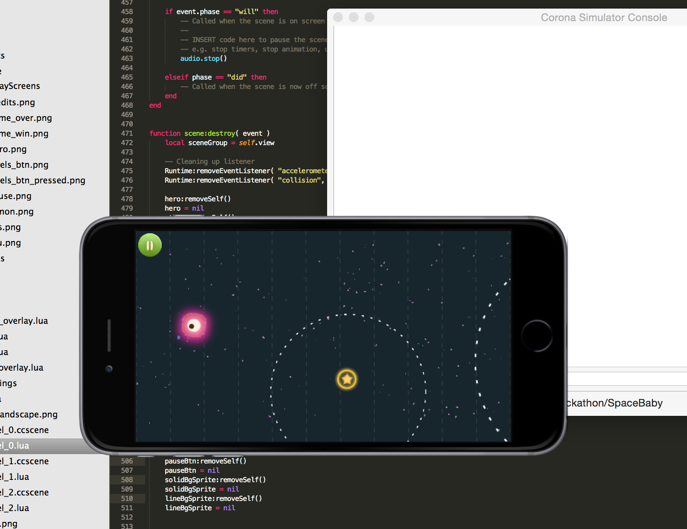
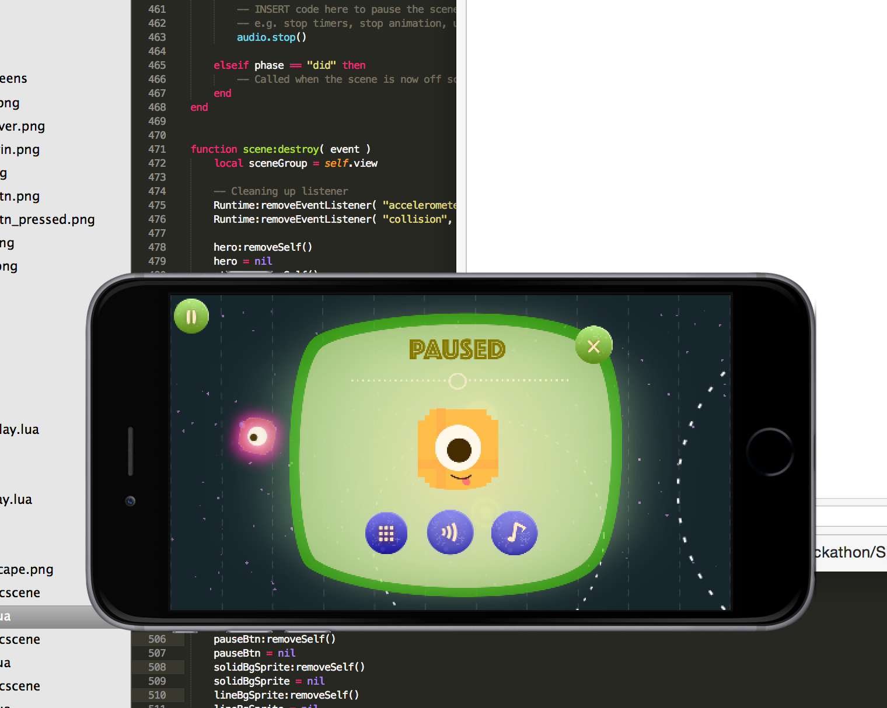
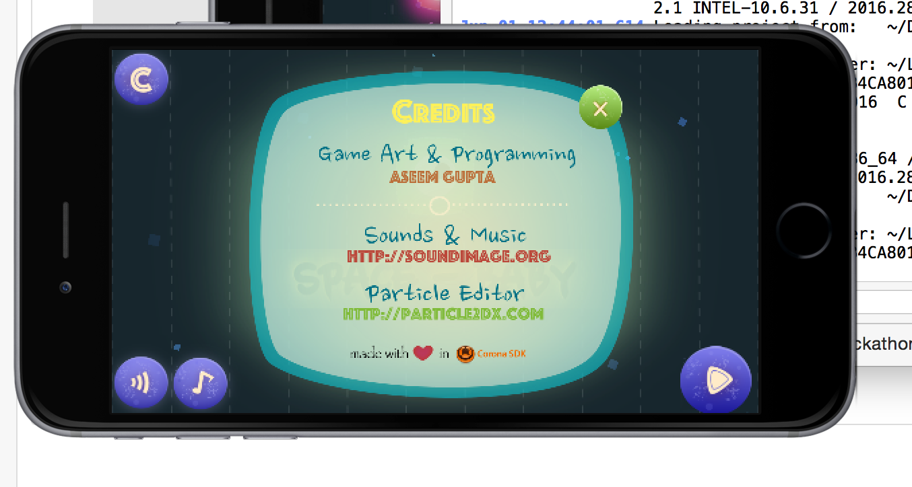
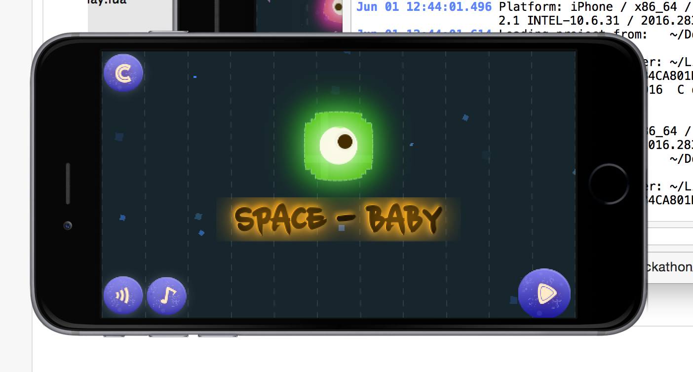
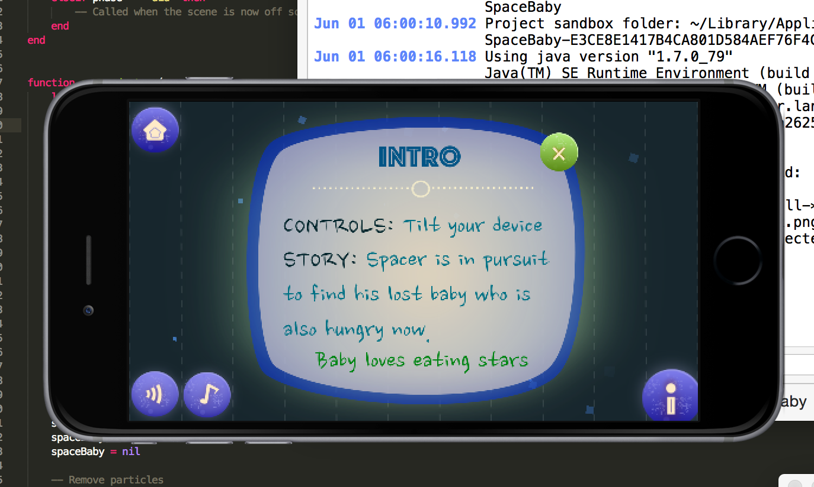
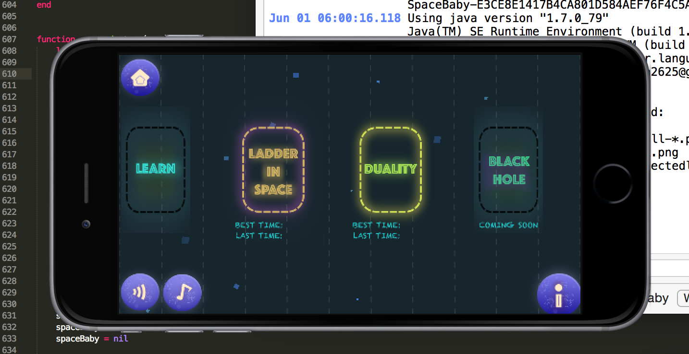
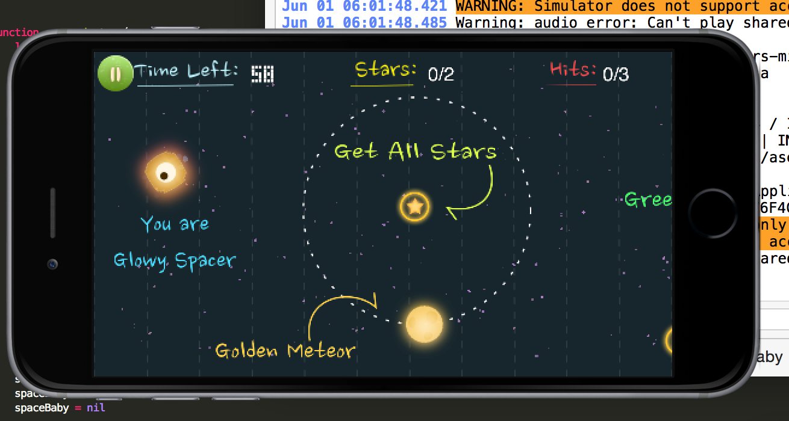
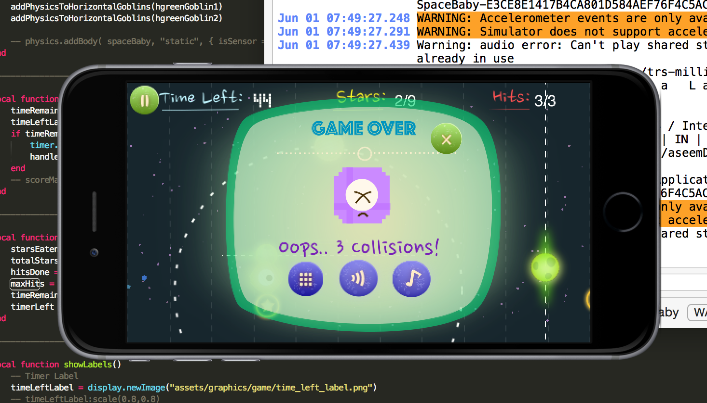
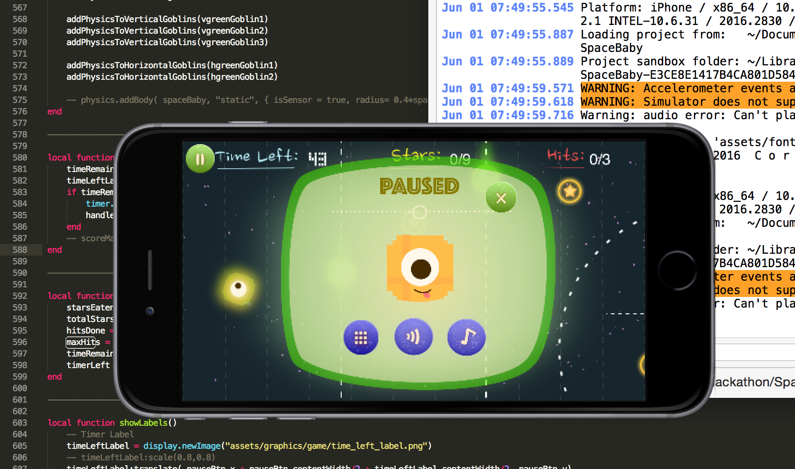
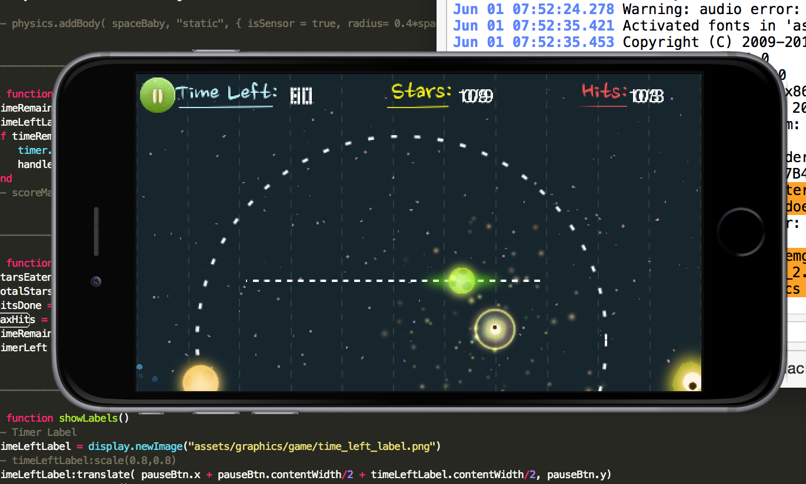
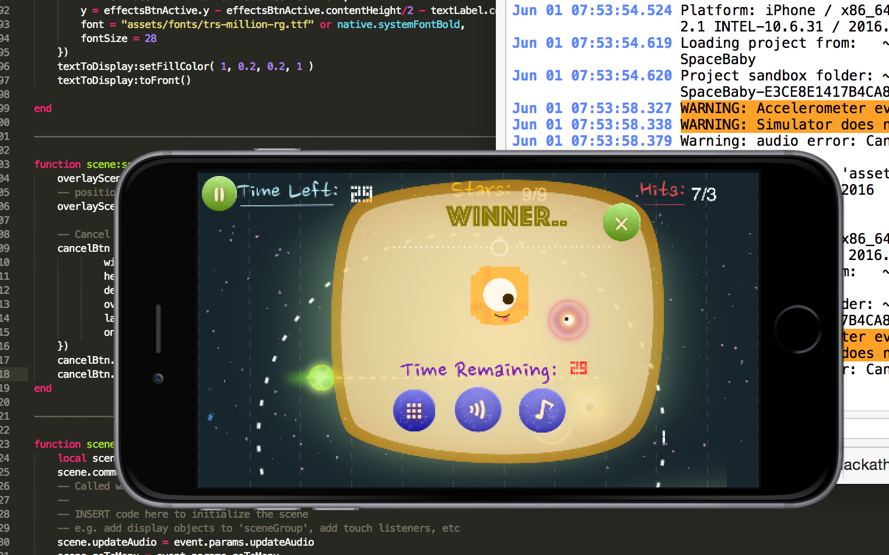
